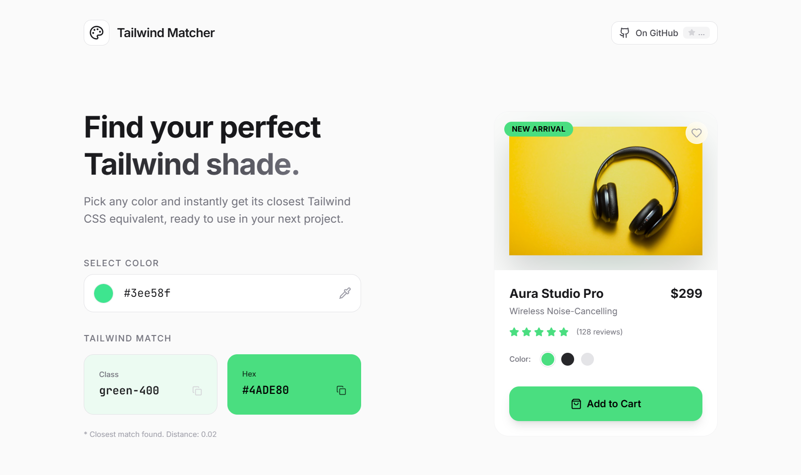

<div align="center">

</div>

<div align="center">

# 🎨 Tailwind Matcher

**Find your perfect Tailwind CSS shade instantly**

*Pick any color and get its closest Tailwind CSS equivalent, ready to use in your next project.*

[](https://github.com/princekouame/tailwind-color-matcher/stargazers)
[](https://opensource.org/licenses/MIT)
[](https://www.typescriptlang.org/)
[](https://reactjs.org/)
[](https://tailwindcss.com/)

[🚀 Live Demo](https://tailwind-matcher.vercel.app/) • [📖 Documentation](#usage) • [🐛 Report Bug](https://github.com/princekouame/tailwind-color-matcher/issues) • [✨ Request Feature](https://github.com/princekouame/tailwind-color-matcher/issues)

</div>

---

## ✨ Features

- **🎯 Instant Color Matching** - Get the closest Tailwind CSS color class for any hex color
- **📋 One-Click Copy** - Copy Tailwind classes and hex codes with a single click
- **🎨 Live Preview** - See how colors look on a sample e-commerce card
- **📱 Fully Responsive** - Works perfectly on desktop, tablet, and mobile devices
- **⚡ Real-time Updates** - Instant feedback as you pick colors
- **🌟 Modern UI** - Clean, minimalist design with smooth animations
- **🔍 Accessibility** - High contrast support and keyboard navigation

## 🚀 Quick Start

### Prerequisites

- Node.js (version 16 or higher)
- npm or yarn

### Installation

1. **Clone the repository**
   ```bash
   git clone https://github.com/princekouame/tailwind-color-matcher.git
   cd tailwind-color-matcher
   ```

2. **Install dependencies**
   ```bash
   npm install
   ```

3. **Start the development server**
   ```bash
   npm run dev
   ```

4. **Open your browser**

   Navigate to `http://localhost:3000` to see the app running.

## 📖 Usage

### Basic Color Matching

1. **Select a color** - Use the color picker or enter a hex code (e.g., `#6366f1`)
2. **Get instant results** - The app automatically finds the closest Tailwind CSS equivalent
3. **Copy the class** - Click on the Tailwind class card to copy `bg-indigo-500`
4. **Copy the hex** - Click on the hex code card to copy `#6366f1`

### Example Workflow

```typescript
// Input: #3b82f6
// Output: bg-blue-500 (closest match)

// Usage in your Tailwind project:
<div className="bg-blue-500 text-white p-4 rounded-lg">
  Hello World!
</div>
```

## 🛠️ Tech Stack

- **Frontend Framework:** React 18 with TypeScript
- **Styling:** Tailwind CSS
- **Build Tool:** Vite
- **Animations:** Framer Motion
- **Icons:** Lucide React
- **Deployment:** Vercel

## 📁 Project Structure

```
tailwind-color-matcher/
├── public/
│   ├── open-graph.png
│   └── favicon.svg
├── src/
│   ├── components/
│   │   ├── ColorPicker.tsx
│   │   └── EcommerceCard.tsx
│   ├── utils/
│   │   └── colors.ts
│   ├── App.tsx
│   └── main.tsx
├── index.html
├── package.json
├── tailwind.config.js
└── vite.config.ts
```

## 🎯 Color Matching Algorithm

The app uses a sophisticated color matching algorithm that:

1. **Calculates color distance** using the CIEDE2000 color difference formula
2. **Compares against all Tailwind colors** in the official palette
3. **Returns the closest match** with distance measurement
4. **Provides hex codes** for exact color reproduction

## 🤝 Contributing

Contributions are welcome! Here's how you can help:

### Development Setup

1. Fork the repository
2. Create a feature branch: `git checkout -b feature/amazing-feature`
3. Make your changes
4. Run tests: `npm run test`
5. Commit your changes: `git commit -m 'Add amazing feature'`
6. Push to the branch: `git push origin feature/amazing-feature`
7. Open a Pull Request

### Guidelines

- Follow the existing code style
- Add tests for new features
- Update documentation as needed
- Ensure all tests pass
- Use conventional commit messages

## 📄 License

This project is licensed under the MIT License - see the [LICENSE](LICENSE) file for details.

## 🙏 Acknowledgments

- [Tailwind CSS](https://tailwindcss.com/) for the amazing color palette
- [React](https://reactjs.org/) for the powerful UI framework
- [Vite](https://vitejs.dev/) for the blazing fast build tool
- [Framer Motion](https://www.framer.com/motion/) for smooth animations

## 📞 Contact dev

**Prince Kouamé**

- Website: [princekouame.com](https://www.princekouame.com)
- LinkedIn: [linkedin.com/in/princekouame](https://www.linkedin.com/in/princekouame)
- Email: hello@princekouame.com
- GitHub: [@princekouame](https://github.com/kouame09)

---


